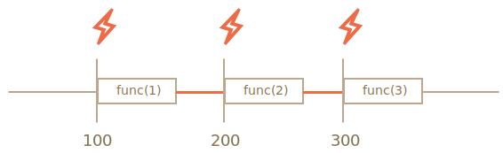

# 内置对象 定时器

## TL;DR

定时器用于处于定时任务，尽快执行函数，执行动画，任务分片，防抖节流也有用到，用处广泛

## setTimeout

`let timerId = setTimeout(func|code, [delay], [arg1], [arg2], ...)`

### 参数

- function/code

function 是你想要在 delay 毫秒之后执行的函数
code 是一个替代语法，你可以使用字符串代替 function ，在 delay 毫秒之后执行字符串 (使用该语法是不推荐的, 原因和使用 eval()一样，有安全风险)

::: danger 注意这里是传入函数，而不是运行函数
setTimeout(sayHi(), 1000);// wrong!
:::

- delay 可选

延迟的毫秒数 (一秒等于 1000 毫秒)，函数的调用会在该延迟之后发生。**如果省略该参数，delay 取默认值 0**。实际的延迟时间可能会比 delay 值长，原因请查看 Reasons for delays longer than specified

- param1, ..., paramN 可选

附加参数，一旦定时器到期，它们会作为参数传递给 function 或 执行字符串（setTimeout 参数中的 code）
定时器的第一个参数 字符串（不推荐，会造成 JS 二次解析）/函数

### 返回值

返回值 timeoutID 是一个正整数，表示定时器的编号。这个值可以传递给 clearTimeout()来取消该定时。需要注意的是 **setTimeout()和 setInterval()共用一个编号池**

### 注意事项

- 定时器的销毁你要注意，不仅仅是你不使用的时候，当这个组件销毁的时候（比如路由切换的时候，要在其生命周期里面手动销毁）

- 定时器都有最短的时间间隔，据[ HTML5 standard ](https://html.spec.whatwg.org/multipage/timers-and-user-prompts.html#timers) ：after five nested timers, the interval is forced to be at least 4 milliseconds.

### Recursive setTimeout

```js
let timerId = setTimeout(function tick() {
  alert("tick");
  timerId = setTimeout(tick, 2000); // (*)
}, 2000);
```

优点：

- more flexible method than setInterval. This way the next call may be scheduled differently, depending on the results of the current one.
- Recursive setTimeout guarantees a delay between the executions, setInterval – does not.

## setInterval

setInterval 的任务之间延时小于其设定的时间，如图所示



> 网上一些文章说 setInterval 在进程繁忙的时候，会跳过，这个说对了一半

其运行过程 应该是 setNextTimer(),然后 doJob()。

举个例子，就像一列有时刻表的列车，如果被延时了，那么被延时的列车会发车。（延时期间该发的车不会再次发了）。正常之后还是按着原有的时刻表发车
[查看示例](https://jsfiddle.net/liugq/n9Ljq1cw/)

我们设置动画间隔的时候，常常会设置其时间间隔为 16ms，因为每秒渲染 60 帧可以给用户带来比较流畅的动画体验。`1s=1000ms`,`1000/60 = 16`

但是 setInterval 和 setTimeout 并不能保证在指定时间间隔或者延迟的情况
下准时调用指定函数。所以可以换一个思路,当指定函数调用的时候,根据逝去的时间计算当前
这一帧应该显示成什么样子,这样即使因为浏览器渲染主线程忙碌导致一帧渲染时间超过 16 毫
秒,在后续帧渲染时至少内容不会因此滞后即使达不倒 60fps 的效果,也能保证动画在指定时
间内完成。

下面是一个这种方法实现动画的例子,首先我们实现一个 raf 函数,raf 是 request animation
frame 的缩写,代码如下:

```js
var lastTimeStamp = new Date().getTime();
function raf(fn) {
  var currTimeStamp = new Date().getTime();
  var delay = math.max(0, 16 - -lastTimeStamp);
  var handle = setTimeout(function() {
    fn(currTimeStamp);
  }, delay);
  lastTimeStamp = currTimeStamp;
  return handle;
}
```

## requestanimationframe

::: tip 比 setTimeout 做动画更好
浏览器主动优化，非活动的标签页动画可以暂停，更省电

:::

运行 [demo](https://codepen.io/chriscoyier/pen/ltseg):

```js
var globalID;

function repeatOften() {
  $("<div />").appendTo("body");
  globalID = requestAnimationFrame(repeatOften);
}

$("#start").on("click", function() {
  globalID = requestAnimationFrame(repeatOften);
});

$("#stop").on("click", function() {
  cancelAnimationFrame(globalID);
});
```

## setTimeout 分片任务

> setTimeout 分片任务计算斐波那契数列，首先了解一下什么是斐波那契数列，由 0 和 1 开始，之后的费波那契系数就是由之前的两数相加而得出。首几个费波那契系数是：0, 1, 1, 2, 3, 5, 8, 13, 21, 34, 55, 89, 144, 233……

```js
// 虽然我之后看了网上利用三元运算符，一行代码完事的
function fib(n) {
  if (n < 2) {
    return 1;
  }
  return fib(n - 1) + fib(n - 2);
}
```

```js
function fib(n) {
  return new Promise((resolve, reject) => {
    if (n < 2) {
      return 1;
    }
    let arr = [1, 1];
    let i = 2;
    setTimeout(function calc() {
      arr[i] = arr[i - 1] + arr[i - 2];
      i++;
      if (i <= n) {
        setTimeout(calc, 50);
      } else {
        resolve(arr[i - 1]);
      }
    }, 50);
  });
}
```

[递归 vs 递推](https://www.zhihu.com/question/20651054)

- 递归是从问题的最终目标出发，逐渐将复杂问题化为简单问题，最终求得问题是逆向的。递推是从简单问题出发，一步步的向前发展，最终求得问题。是正向的。
- 递推的效率高于递归（在递推可以计算的情况下，比如本例子）

## 参考

- [Scheduling: setTimeout and setInterval](https://javascript.info/settimeout-setinterval)
- [using-requestanimationframe](https://css-tricks.com/using-requestanimationframe/)
- [Javascript 高性能动画与页面渲染](https://www.infoq.cn/article/javascript-high-performance-animation-and-page-rendering/)
