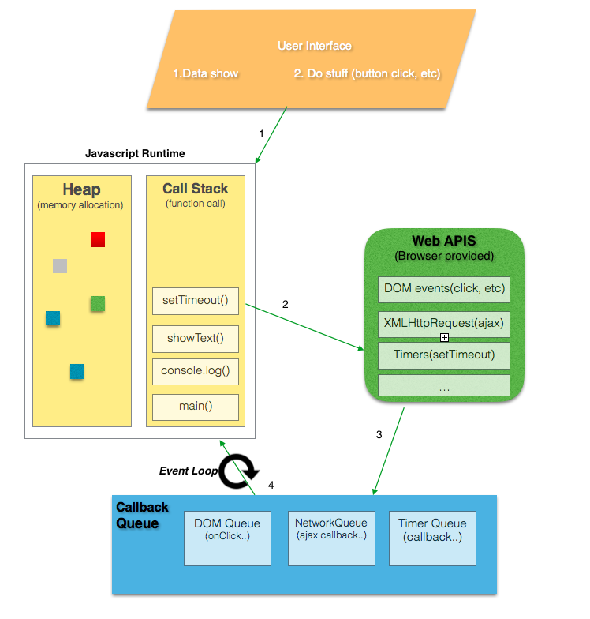

# 函数执行

javascript 是单线程的的语言，则一次只能处理一次事件，那么他是如何处理异步事件的呢？

## 基本概念

- Call Stack

It’s a data structure which records the function calls, basically where in the program we are. If we call a function to execute , we push something on to the stack, and when we return from a function, we pop off the top of the stack.

- Heap

**Objects are allocated in a heap** i.e mostly unstructured region of memory. All the memory allocation to variables and objects happens here.

- Queue

A JavaScript runtime contains a **message queue**, which is a list of messages to be processed and the associated callback functions to execute.

## The Execution Context

## Event Loop

Event loop basic job is to look both at **the stack and the task queue**, pushing the first thing on the queue to the stack when it see stack as empty

## 参考

- [Understanding Javascript Function Executions — Call Stack, Event Loop , Tasks & more](https://medium.com/@gaurav.pandvia/understanding-javascript-function-executions-tasks-event-loop-call-stack-more-part-1-5683dea1f5ec)
