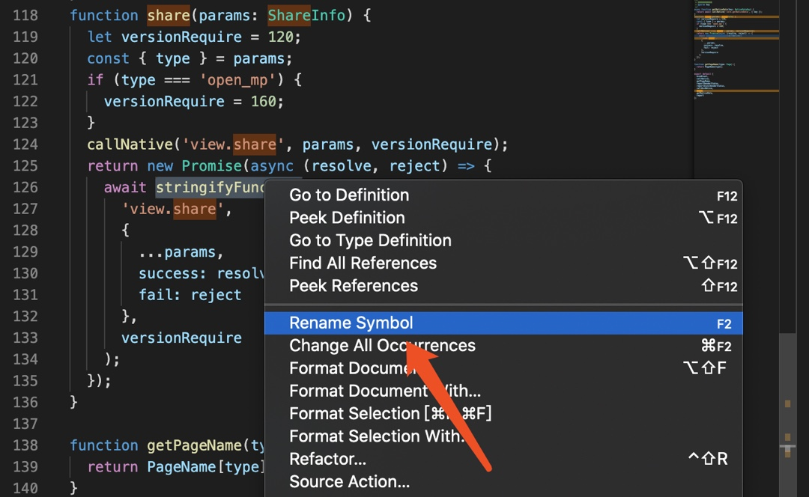

# 编辑器 vscode

> 毕竟现在是前端标配了，这款编辑器需要学习一些用法帮助你开发

## vscode 设置 workspace

很方便的切换任务,或者你可以使用插件 project manage

## 重构变量

还再用查找和替换修改函数名么（它的问题是有可能误伤相似的名字），在 vscode 里面试试 rename symbol ,选中变量，鼠标右击，如图



## 代码结构

代码写长了，不妨将代码收起来，组合键 `command+k` `command+0`

收起展开部分代码，收起的快捷键是 `cmd + k , cmd +[` , 这个组合键不太方便，可以将它修改为 cmd + [

## 设置 vscode 字体

推荐这一款字体:https://github.com/tonsky/FiraCode，安装完之后，在vscode的配置如下

```json
"terminal.integrated.fontFamily": "Fira Code",
"editor.fontFamily": "Fira Code",
```

## vscode 主题

以前我使用 vscode 官方的主题，但是还是感觉有点不是。Monokai Dimmind 这个主题就是非常的不错，感觉十分的柔和，不伤眼睛。

## vscode 实现远端开发部署

1. 远程主机安装 openssh-server`apt-get install openssh-server`
2. 本地主机安装 openssh-client，mac os 自带，跳过这一步`apt-get install openssh-client`
3. vscode 安装 Remote Development 插件
4. 更改配置。通过 ctrl+shift+p 打开设置 Remote-SSH-Settings，设置 Remote.SSH:Show Login Terminal 为 true，这样每次都会询问密码。
5. 添加主机。可以把常用的主机都保存下来。安装完插件后左下角会出现一个绿色的图标，点击选择会在命令窗口弹出几个选项，可以可视化添加 ssh 配置，也可以编辑配置文件。

## 比较(diff)两个文件

- [diff vscode 插件](https://marketplace.visualstudio.com/items?itemName=fabiospampinato.vscode-diff)
- vscode 自带，在 vscdoe 的文件列表下选中待比较文件 1，右键-选择以进行比较,然后选中第二文件，右键-与已选择文件比较

## [vscode 快捷键列表查询](https://code.visualstudio.com/shortcuts/keyboard-shortcuts-windows.pdf)

当然它预设的快捷键可能不太够用，你可以自定义快捷键。你`ctrl_shift+p`打开快捷键方式文件，可以看到又很多的`action`被它注释掉了，一般你想用的，它都有。添加到你自定义的快捷方式里面即可

### ctrl+p 搜索文件

### ctrl+shift+o 打开文件的大纲

现在文件长度都有点长，我不太像用鼠标来回翻页，但是用上下键移动很慢，今天得知，可以使用 ctrl+shift+o 打开 vscode 的大纲，然后用上下键快速跳转，写 markdown 的时候特别好用

## vscode 直跳

vscode 当按住 command + click 跳转到定义文件之后，如何跳转回来？快捷键 ctrl+'-' ，还是挺好用的

## 解决 vscode 卡顿

忽视了文件

试试在 setting 里面加入如下代码

```json
    "search.followSymlinks": false,
    "files.exclude": {
        "**/.git": true,
        "**/.svn": true,
        "**/.hg": true,
        "**/CVS": true,
        "**/.DS_Store": true,
        "**/tmp": true,
        "**/node_modules": true,
        "**/bower_components": true,
        "**/dist": true
    },
    "files.watcherExclude": {
        "**/.git/objects/**": true,
        "**/.git/subtree-cache/**": true,
        "**/node_modules/**": true,
        "**/tmp/**": true,
        "**/bower_components/**": true,
        "**/dist/**": true
    }
```

## 参考

- [23 lesser known VS Code Shortcuts as GIF](https://dev.to/devmount/23-lesser-known-vs-code-shortcuts-as-gif-80)
